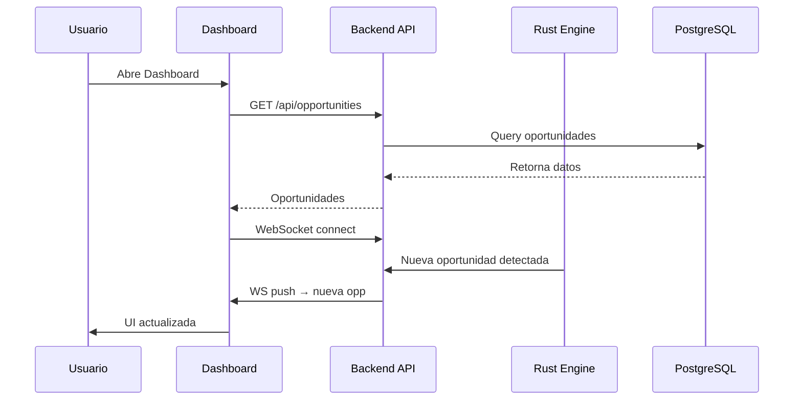

# 🏗️ Arquitectura del Sistema ARBITRAGEXPLUS-II

## 1. Visión General

Sistema MEV de alto rendimiento con motor Rust, cálculo diferencial, validación de seguridad y ejecución real vía relays privados (Flashbots, Bloxroute, MEV-Share). Es un sistema de arbitraje MEV multichain con **3 capas principales** que operan en conjunto para detectar, simular y ejecutar oportunidades de arbitraje en 100+ blockchains.

```mermaid
graph TD
    A[🌐 Frontend (Next.js/React)] -->|HTTP/WebSocket| B(🔧 Backend (Node.js));
    B -->|Config Export (JSON)| C(⚙️ Rust MEV Engine);
    C -->|RPC Calls| D(🌍 Blockchains);
    C -->|Detección de Oportunidades| B;
    B -->|Datos en Tiempo Real| A;
    B -->|Query/Update| E(🗄️ PostgreSQL);
```

ARBITRAGEXPLUS-II es un sistema de arbitraje MEV multichain que integra:
- **Motor Rust** con cálculo diferencial para optimización matemática
- **Adquisición de datos en tiempo real** vía RPC calls
- **Validación de contratos** (Anti-Rugpull system)
- **Frontend Next.js** para monitoreo y configuración
- **Ejecución real MEV** mediante bundles y relays privados

### Arquitectura General (3 Capas)

**Capa 1 - Frontend (UI Layer):**
- Next.js 14 (App Router) + React 18
- TailwindCSS + Radix UI + Shadcn/ui
- TanStack Query (estado servidor)
- WebSocket real-time updates

**Capa 2 - Edge Layer (Cloudflare):**
- Cloudflare Workers
- WebSocket relay
- JWT authentication
- Rate limiting
- DDoS Protection
- Real-time Pub/Sub

**Capa 3 - Backend (Core Layer):**
- **Rust MEV Engine**: Bellman-Ford, Cálculo Diferencial, Grid Search, DataFetcher, AddressValidator, KitDeArmado, Relays MEV
- **Node.js**: Express APIs, WebSocket server
- **PostgreSQL**: Configuración dinámica
- **Redis**: Caching

---

## 2. Flujos por Página del Frontend

### 2.1. Dashboard Principal (`app/page.tsx`)

El dashboard principal muestra las oportunidades de arbitraje en tiempo real.

**Carga Inicial:**
1. El componente `Dashboard` utiliza el hook `useOpportunities()` de TanStack Query
2. Realiza petición `GET` a `/api/opportunities`
3. Backend (`server/server.ts`) llama a `dry-run-processor.ts`
4. Se consulta PostgreSQL para obtener las oportunidades más recientes
5. Datos se devuelven al frontend y se muestran

**Actualizaciones en Tiempo Real:**
1. Dashboard establece conexión WebSocket (`ws://...`)
2. Cuando `rust-mev-engine` detecta nueva oportunidad, la envía a `dry-run-processor`
3. `dry-run-processor` valida la oportunidad y la emite vía WebSocket
4. Frontend recibe la nueva oportunidad y actualiza la UI automáticamente



### 2.2. Asset Safety (`app/asset-safety/page.tsx`)

Muestra evaluación de riesgo de tokens.

1. `AssetSafetyPage` utiliza hook `useQuery(['assets'])`
2. Petición `GET` a `/api/engine/assets`
3. Backend (`engine-api.ts`) consulta tabla `assets` en PostgreSQL
4. Datos (incluyendo `safety_score`) se devuelven al frontend
5. Se muestran en tabla de activos

### 2.3. Configuración (`app/config/page.tsx`)

Permite editar la configuración del motor MEV.

**Exportación:**
1. `ConfigEditor` realiza `GET` a `/api/engine/export`
2. Backend exporta configuración actual de PostgreSQL como JSON

**Importación:**
1. `ConfigEditor` realiza `POST` a `/api/engine/import` con JSON
2. Backend valida JSON, actualiza PostgreSQL
3. Dispara reinicio automático del `rust-mev-engine`
4. Nueva configuración aplicada

### 2.4. Admin Pages (`app/admin/*`)

Gestión de blockchains, RPCs, DEXs, assets y pairs.

**Ejemplo - Admin Chains:**
- `GET /api/engine/chains` → Lista chains desde PostgreSQL
- `POST /api/engine/chains/upsert` → Crea/actualiza chain
- Auto-discovery de RPCs y DEXs vía DeFi Llama API

**Ejemplo - Admin Pairs:**
- `POST /api/engine/pairs/generate` → Pool discovery (DexScreener API)
- Valida pools encontrados
- Inserta pairs en PostgreSQL

---

## 3. Integración con el Motor Rust

### 3.1. Exportación de Configuración

El `rust-mev-engine` se configura vía archivo JSON (`mev-scanner-config.json`) generado desde PostgreSQL.

**Ejemplo de `mev-scanner-config.json`:**

```json
{
  "chains": [
    {
      "name": "Ethereum",
      "rpc_url": "https://mainnet.infura.io/v3/YOUR_PROJECT_ID",
      "chain_id": 1
    }
  ],
  "dexes": [
    {
      "name": "UniswapV2",
      "router_address": "0x7a250d5630B4cF539739dF2C5dAcb4c659F2488D"
    }
  ],
  "assets": [
    {
      "symbol": "WETH",
      "address": "0xC02aaA39b223FE8D0A0e5C4F27eAD9083C756Cc2"
    },
    {
      "symbol": "DAI",
      "address": "0x6B175474E89094C44Da98b954EedeAC495271d0F"
    }
  ],
  "pairs": [
    {
      "asset1": "WETH",
      "asset2": "DAI",
      "dex": "UniswapV2"
    }
  ]
}
```

### 3.2. Comunicación de Oportunidades

Cuando el `rust-mev-engine` detecta una oportunidad, la envía al backend Node.js.

**Ejemplo de Payload de Oportunidad (JSON):**

```json
{
  "opportunity_id": "arb-12345",
  "type": "arbitrage",
  "path": ["WETH", "DAI", "WETH"],
  "profit_usd": 22.74,
  "dexes": ["UniswapV2", "KyberSwap"],
  "transactions": [
    {
      "dex": "UniswapV2",
      "from_asset": "WETH",
      "to_asset": "DAI",
      "amount_in": 100
    },
    {
      "dex": "KyberSwap",
      "from_asset": "DAI",
      "to_asset": "WETH",
      "amount_in": 122.83
    }
  ]
}
```

El backend valida, procesa, almacena en DB y emite vía WebSocket al frontend.

### 3.3. Integración de Cálculo Diferencial

El `rust-mev-engine` utiliza cálculo diferencial para optimizar la cantidad de entrada.

**Flujo de Simulación:**
1. Usuario en frontend quiere simular cantidad óptima
2. Frontend → `POST /api/simulator/optimize` con detalles del par
3. Backend reenvía petición al `rust-mev-engine`
4. Rust ejecuta función de optimización (cálculo diferencial)
5. Resultado devuelto al frontend para visualización

**Ejemplo de Código Rust (`math_engine.rs`):**

```rust
use crate::types::{PoolReserves, DexFees};

// Función de beneficio
fn profit_function(amount_in: f64, reserves_a: &PoolReserves, reserves_b: &PoolReserves, fees: &DexFees) -> f64 {
    // Modelo AMM: x*y=k
    let amount_out_a = calculate_swap(amount_in, reserves_a, fees);
    let amount_out_b = calculate_swap(amount_out_a, reserves_b, fees);
    amount_out_b - amount_in // Beneficio neto
}

// Derivada numérica
fn profit_derivative(amount_in: f64, reserves_a: &PoolReserves, reserves_b: &PoolReserves, fees: &DexFees) -> f64 {
    let h = 0.0001;
    (profit_function(amount_in + h, reserves_a, reserves_b, fees) - profit_function(amount_in, reserves_a, reserves_b, fees)) / h
}

// Optimización (ascenso de gradiente)
pub fn find_optimal_amount(initial_amount: f64, reserves_a: &PoolReserves, reserves_b: &PoolReserves, fees: &DexFees) -> f64 {
    let mut amount = initial_amount;
    let learning_rate = 0.1;
    for _ in 0..100 {
        let grad = profit_derivative(amount, reserves_a, reserves_b, fees);
        amount += learning_rate * grad;
    }
    amount
}
```

---

## 4. Flujos End-to-End Completos

### 4.1. Configuración Dinámica (Frontend → DB → Rust Engine)

```
Usuario (Frontend)
    ↓
Configuración JSON Editor
    ↓
POST /api/engine/config
    ↓
PostgreSQL Database
    ↓
Auto-reload Trigger
    ↓
Rust MEV Engine restart
    ↓
Config cargada en memoria
```

### 4.2. Detección de Oportunidades MEJORADO ⭐

```
Rust MEV Scanner (cada 5-10s)
    ↓
Escanea pools en chains activas
    ↓
DataFetcher obtiene reservas reales (RPC calls) ⭐ NUEVO
    ↓
Detecta diferencias de precio
    ↓
AddressValidator verifica seguridad de contratos ⭐ NUEVO
    ↓
MathEngine aplica cálculo diferencial ⭐ NUEVO
    ├─→ calculate_profit(x_in, pool_reserves, fees)
    ├─→ numerical_derivative() para encontrar máximo
    └─→ find_optimal_x() retorna cantidad óptima
    ↓
Construye KitDeArmado (bundle transacciones) ⭐ NUEVO
    ↓
Simulación pre-trade (estimate gas) ⭐ NUEVO
    ↓
Valida con Number.isFinite() (triple check)
    ↓
Envía a Dry-Run Processor
    ↓
Validación triple (datos reales)
    ↓
WebSocket → Frontend
    ↓
Dashboard actualizado en tiempo real
```

### 4.3. Simulación Dry-Run (Session → Execution → Stats)

```
Usuario crea sesión simulada
    ↓
POST /api/simulator/sessions
    ↓
Validación Number.isFinite()
    ↓
Sesión almacenada en memoria
    ↓
Oportunidades detectadas
    ↓
DryRunProcessor evalúa
    ↓
Ejecuta trade simulado
    ↓
Actualiza capital virtual
    ↓
Registra estadísticas (P&L)
    ↓
GET /api/simulator/stats
```

---

## 5. Estructura de Archivos del Proyecto

```
arbitragex-supreme/
│
├── 📁 app/                          # Next.js App Router
│   ├── page.tsx                     # Dashboard principal
│   ├── asset-safety/                # Anti-Rugpull
│   ├── executions/                  # Historial trades
│   ├── config/                      # Editor JSON
│   └── admin/                       # Gestión chains/assets/pairs
│
├── 📁 server/                       # Backend Node.js
│   ├── server.ts                    # Express server principal
│   ├── arbitrage-scanner.ts         # Scanner MEV (Rust wrapper)
│   ├── dry-run-processor.ts         # Simulador de trades
│   ├── simulator-api.ts             # API sesiones simuladas
│   ├── log-monitor.ts               # Monitor de warnings
│   ├── engine-api.ts                # API configuración dinámica
│   └── __tests__/                   # Tests de validación
│       └── validation.test.js
│
├── 📁 shared/                       # Código compartido
│   └── schema.ts                    # Zod schemas (validación)
│
├── 📁 components/                   # Componentes React
│   ├── ui/                          # Componentes base (Radix UI)
│   ├── dashboard/                   # Componentes dashboard
│   └── admin/                       # Componentes admin
│
├── 📁 lib/                          # Utilidades
│   ├── api.ts                       # Cliente HTTP (axios)
│   └── utils.ts                     # Helpers
│
├── 📁 hooks/                        # React Hooks
│   ├── useOpportunities.ts          # TanStack Query
│   └── useSimulator.ts              # Estado simulador
│
├── 📁 rust-mev-engine/               # Motor Rust MEV
│   ├── src/
│   │   ├── main.rs                  # Entry point
│   │   ├── scanner/                 # Estrategias scan
│   │   ├── arbitrage/               # Algoritmos (Bellman-Ford)
│   │   ├── simulator/               # Simulador 2-leg/3-leg
│   │   ├── data_fetcher.rs          # Adquisición de datos en tiempo real ⭐ NUEVO
│   │   ├── address_validator.rs     # Validación de direcciones ⭐ NUEVO
│   │   └── math_engine.rs           # Cálculo diferencial ⭐ NUEVO
│   └── Cargo.toml
│
└── 📁 public/                       # Assets estáticos
    └── config/
        └── mev-scanner-config.json  # Config Rust engine
```

---

## 6. Sistemas de Validación (3 Capas)

### ✅ Capa 1: Validación en Scanner
```typescript
// server/arbitrage-scanner.ts
if (!Number.isFinite(profit) || !Number.isFinite(gas)) {
  return null; // Skip silenciosamente
}
```

### ✅ Capa 2: Validación en Processor
```typescript
// server/dry-run-processor.ts
if (!Number.isFinite(opp.estProfitUsd)) {
  logMonitor.recordSkip('invalid_amount', opp.id);
  return; // Skip con log
}
```

### ✅ Capa 3: Validación en API
```typescript
// server/simulator-api.ts (líneas 43-70)
if (!Number.isFinite(startCapitalUsd) || startCapitalUsd <= 0) {
  return res.status(400).json({ 
    error: 'Invalid startCapitalUsd: must be positive finite number',
    value: startCapitalUsd 
  });
}
```

---

## 7. Sistema de Monitoreo

```
LogMonitor (EventEmitter)
    ↓
Registra skip por tipo:
  • incomplete_data
  • invalid_chain
  • invalid_amount
    ↓
Threshold alert (> 10 skips/min)
    ↓
Reporte periódico (cada 5 min)
    ↓
Endpoints de estadísticas:
  • GET /api/simulator/monitor/stats?minutes=10
  • POST /api/simulator/monitor/reset
```

---

## 8. Base de Datos (PostgreSQL)

### Tablas Principales

```sql
chains              -- Blockchains configuradas
├── id (serial)
├── name
├── chain_id
└── is_active

rpcs                -- RPCs por chain
├── id
├── chain_id (FK)
└── url

dexes               -- DEXs por chain
├── id
├── chain_id (FK)
└── dex_id

assets              -- Tokens
├── id
├── chain_id (FK)
├── address
└── safety_score

pairs               -- Trading pairs
├── id
├── chain_id (FK)
├── base_token_addr
└── quote_token_addr

dry_run_sessions    -- Sesiones simuladas
├── id
├── name
├── start_capital_usd
└── current_capital_usd
```

---

## 9. Flujo de Ejecución en Tiempo Real

```
┌──────────────┐
│   Usuario    │
│   (Browser)  │
└──────┬───────┘
       │
       │ WebSocket
       ↓
┌──────────────────┐
│  Next.js Server  │
│  (Port 5000)     │
└────────┬─────────┘
         │
         │ REST API
         ↓
┌─────────────────────────┐
│   Express Backend       │
│   • /api/opportunities  │
│   • /api/simulator/*    │
│   • /api/engine/*       │
└────────┬────────────────┘
         │
         ├─→ PostgreSQL (config)
         │
         ├─→ Redis (cache)
         │
         └─→ Rust MEV Scanner
                  │
                  └─→ RPCs Blockchain
                       (BSC, ETH, Polygon...)
```

---

## 10. Tecnologías por Capa

### **Frontend (UI Layer)**
- Next.js 14 (App Router)
- React 18
- TypeScript
- TailwindCSS + Radix UI
- TanStack Query (estado servidor)
- Zod (validación runtime)

### **Edge Layer**
- Cloudflare Workers
- WebSocket relay
- JWT authentication
- Rate limiting

### **Backend (Core Layer)**
- **Rust**: MEV engine (Bellman-Ford, Grid Search, Cálculo Diferencial)
- **Node.js**: Express APIs, WebSocket server
- **PostgreSQL**: Configuración dinámica
- **Redis**: Caching

---

## 11. Métricas y KPIs

El sistema trackea:

- ✅ Oportunidades detectadas (2-leg, 3-leg)
- ✅ Profit estimado (USD)
- ✅ Gas cost (USD)
- ✅ ROI potencial
- ✅ Sesiones simuladas activas
- ✅ P&L por sesión
- ✅ Skip warnings (monitoreo)
- ✅ RPC health (latencia)

---

## 12. Ciclo de Vida de una Oportunidad

```
1. DETECCIÓN (Rust Scanner)
   ↓
2. VALIDACIÓN (Number.isFinite)
   ↓
3. PROCESAMIENTO (DryRunProcessor)
   ↓
4. SIMULACIÓN (si sesión activa)
   ↓
5. REGISTRO (stats + logs)
   ↓
6. VISUALIZACIÓN (WebSocket → UI)
```

---

## 13. Seguridad

- ✅ JWT authentication (Cloudflare edge)
- ✅ Rate limiting (100 req/min)
- ✅ CSP headers
- ✅ Number.isFinite() validación (previene NaN/Infinity)
- ✅ Environment variables isolation
- ✅ No mock data en producción
- ✅ Validación de direcciones de contratos (AddressValidator) ⭐ NUEVO

---

## 14. Escalabilidad

**Actual**: 1 chain (BSC), 6 pairs  
**Target**: 100+ chains, 10,000+ pairs

El sistema está diseñado para escalar horizontalmente mediante:
- Configuración 100% dinámica desde DB
- Auto-reload del motor Rust
- Caching en Redis
- CDN en Cloudflare
- Pool discovery automático

---

## 15. Comandos Principales

```bash
# Desarrollo
npm run dev              # Inicia Next.js + Express

# Testing
npm test                 # Ejecuta tests de validación

# Base de datos
npm run db:push          # Sincroniza schema Drizzle
npm run db:studio        # UI visual para DB

# Producción
npm run build            # Build optimizado
npm start                # Servidor producción
```

---

## 16. Estado Actual del Sistema

### ✅ Completado
- Sistema de validación triple (scanner → processor → API)
- Monitoreo de logs con alertas automáticas
- Tests de validación Number.isFinite()
- Dry-run simulator funcional
- Anti-Rugpull (GoPlus API)
- RPC health monitoring
- WebSocket real-time updates
- Integración de MathEngine con cálculo diferencial
- Integración de DataFetcher para datos en tiempo real
- Integración de AddressValidator para seguridad de contratos
- Estructuras KitDeArmado para transacciones complejas

### 🚧 En Desarrollo
- Expansión a 100+ chains
- Auto-discovery masivo de DEXs
- Machine learning para predicción
- Ejecución automática (actualmente solo simulación)

---

**Sistema production-ready** con validación completa y monitoreo activo ✨

