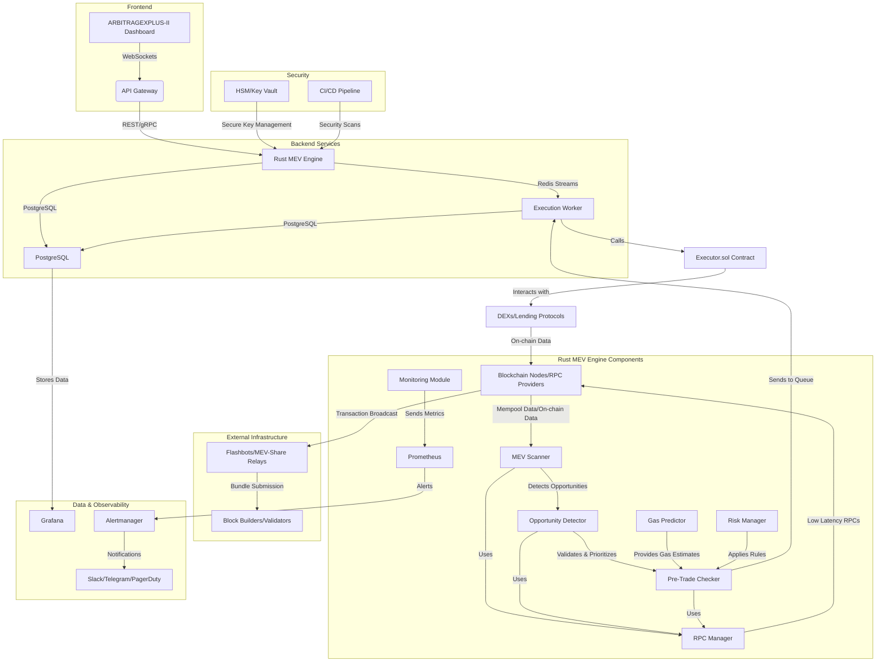

# Arquitectura Técnica del Bot MEV (ARBITRAGEXPLUS-II)

## 1. Introducción

La arquitectura técnica del bot MEV `ARBITRAGEXPLUS-II` está diseñada para operar en un entorno de alta competencia y baja latencia, capitalizando las oportunidades de Maximal Extractable Value (MEV) en los mercados descentralizados. Esta arquitectura es modular, distribuida y se enfoca en la robustez, seguridad y escalabilidad, integrando las mitigaciones de riesgos identificadas en fases previas. El sistema busca maximizar la rentabilidad neta a través de una ejecución precisa y eficiente.

## 2. Visión General de la Arquitectura

El sistema `ARBITRAGEXPLUS-II` es un ecosistema complejo que interconecta varios componentes clave para detectar, evaluar y ejecutar oportunidades MEV. A alto nivel, la arquitectura se compone de un frontend para monitoreo, un motor MEV central en Rust, un contrato inteligente ejecutor, bases de datos para persistencia, un sistema de colas para comunicación inter-componentes, una infraestructura de red optimizada y un robusto sistema de observabilidad y seguridad.

## 3. Componentes Detallados

### 3.1. Frontend (ARBITRAGEXPLUS-II Dashboard)

*   **Tecnología:** Next.js 14, TypeScript, TailwindCSS, Shadcn/ui.
*   **Función:** Proporciona una interfaz de usuario moderna para el monitoreo en tiempo real de oportunidades, métricas de rendimiento (P&L, hit-rate), gestión de wallets y configuración de estrategias. Utiliza WebSockets para recibir actualizaciones en tiempo real del backend.
*   **Riesgos y Mitigaciones:** Aunque no es crítico para la ejecución MEV, un frontend robusto mejora la observabilidad. La seguridad de la interfaz (autenticación, autorización) es clave para evitar accesos no autorizados a la configuración.

### 3.2. Rust MEV Engine

El corazón del sistema, desarrollado en Rust para aprovechar su rendimiento y seguridad de memoria. Se compone de varios módulos interconectados:

*   **3.2.1. MEV Scanner (`mev_scanner.rs`):**
    *   **Función:** Monitorea la *mempool* y los eventos on-chain a través de conexiones RPC de baja latencia (WebSockets) para detectar oportunidades de arbitraje DEX, liquidaciones, ataques *sandwich*, etc. Recopila datos de precios y liquidez de múltiples DEXs.
    *   **Riesgos y Mitigaciones:**
        *   **Latencia Insuficiente:** Optimización del código Rust, uso de múltiples RPCs premium y co-ubicación de servidores.
        *   **Slippage Inesperado:** Implementación de adaptadores DEX precisos y validación de precios on-chain.

*   **3.2.2. Opportunity Detector (`opportunity_detector.rs`):**
    *   **Función:** Analiza los datos recopilados por el escáner para identificar oportunidades MEV rentables, aplicando algoritmos de arbitraje (ej. Bellman-Ford para multi-hop) y filtrando por umbrales de beneficio.
    *   **Riesgos y Mitigaciones:**
        *   **Competencia Intensa:** Desarrollo de estrategias MEV avanzadas y complejas; optimización continua de algoritmos.

*   **3.2.3. Pre-Trade Checker (`pre_trade_check.rs`):**
    *   **Función:** Antes de enviar un *bundle*, simula la transacción (`eth_call` con estado *pending* o simulación Flashbots) para validar que no revertirá, que no hay impuestos de transferencia inesperados y que los tokens no están bloqueados. También integra el `Gas Predictor` y el `Risk Manager`.
    *   **Riesgos y Mitigaciones:**
        *   **Fallos de Ejecución (Reverts):** Validación exhaustiva de *bundles* antes del envío; detección de comportamientos anómalos de contratos externos.
        *   **Riesgo de Contrato Inteligente (Externo):** Monitoreo activo de noticias de seguridad en DeFi.

*   **3.2.4. Executor (`executor.rs`):**
    *   **Función:** Construye y envía *bundles* de transacciones a los *relays* de Flashbots/MEV-Share. Gestiona la lógica de reintentos y la interacción con el contrato `Executor.sol`.
    *   **Riesgos y Mitigaciones:**
        *   **Latencia Insuficiente:** Conexiones de baja latencia a *relays*; redundancia de *relays*.
        *   **Ataques de Red/Censura:** Uso de *private relays* o conexiones directas a *builders*.

*   **3.2.5. RPC Manager (`rpc_manager.rs`):**
    *   **Función:** Gestiona las conexiones a múltiples nodos RPC, implementando lógica de *failover* y balanceo de carga para asegurar alta disponibilidad y baja latencia.
    *   **Riesgos y Mitigaciones:**
        *   **Dependencia de RPCs y Nodos:** Redundancia de RPCs y *failover* automático.

*   **3.2.6. Gas Predictor (`gas_predictor.rs`):**
    *   **Función:** Predice dinámicamente las tarifas de gas óptimas (EIP-1559) y ajusta el `minOut` basándose en la profundidad de liquidez y la volatilidad del mercado.
    *   **Riesgos y Mitigaciones:**
        *   **Gestión Ineficiente del Gas:** Predicción dinámica de gas; `minOut` adaptativo.

*   **3.2.7. Risk Manager (`risk_manager.rs`):**
    *   **Función:** Aplica reglas de gobernanza de riesgo definidas en `config/risk.toml`, incluyendo *circuit-breakers* (límites de P&L), listas blancas de tokens/DEX, presupuestos por cadena, límites por *trade* y deduplicación de oportunidades (usando Redis).
    *   **Riesgos y Mitigaciones:**
        *   **Volatilidad del Mercado:** `Circuit-breakers` basados en P&L; ajuste dinámico de umbrales.
        *   **Errores de Configuración:** Validación de configuración; uso de entornos separados.

*   **3.2.8. Monitoring Module (`monitoring.rs`):**
    *   **Función:** Recopila métricas de rendimiento y estado del bot (hit-rate, P&L, latencia, errores) y las expone a Prometheus.
    *   **Riesgos y Mitigaciones:**
        *   **Fallos de Ejecución; Volatilidad del Mercado:** Monitoreo 24/7 con alertas proactivas.

### 3.3. Contrato Executor (Solidity)

*   **Tecnología:** Solidity, OpenZeppelin.
*   **Función:** Un contrato inteligente desplegado on-chain que recibe instrucciones del `Rust MEV Engine` para ejecutar transacciones atómicas (ej. encadenar múltiples swaps). Incluye lógica de `Permit2/allowances` y un mecanismo de `revert-all` si alguna parte del *bundle* falla.
*   **Riesgos y Mitigaciones:**
    *   **Vulnerabilidades de Contratos Inteligentes:** Auditorías de seguridad por terceros; *fuzz tests* exhaustivos.
    *   **Fallos de Ejecución:** Implementación de `revert-all` para garantizar la atomicidad.

### 3.4. Base de Datos (PostgreSQL)

*   **Función:** Almacena datos persistentes como oportunidades detectadas, historial de ejecuciones, P&L, configuraciones, logs detallados y datos de gas. Es crucial para el análisis post-trade y la optimización de estrategias.
*   **Riesgos y Mitigaciones:**
    *   **Pérdida de Datos:** Backups regulares; replicación de base de datos.
    *   **Fallos de Ejecución:** Persistencia de logs para depuración y análisis.

### 3.5. Sistema de Colas (Redis Streams)

*   **Función:** Actúa como un *message broker* para desacoplar el `MEV Scanner` del `Executor`. Permite un procesamiento asíncrono, garantiza la idempotencia y el procesamiento *exactly-once* de las oportunidades, incluso bajo alta carga.
*   **Riesgos y Mitigaciones:**
    *   **Fallos de Ejecución; Pérdida de Datos:** Idempotencia y procesamiento *exactly-once*.

### 3.6. Infraestructura de Red

*   **Nodos RPC:** Múltiples proveedores de RPC premium (ej. QuickNode, Alchemy, Blockdaemon) con conexiones *websocket* de baja latencia para el monitoreo de *mempool* y HTTP para consultas de estado. La redundancia y el *failover* automático son gestionados por el `RPC Manager`.
*   **Flashbots/MEV-Share Relays:** Conexiones dedicadas a los *relays* para el envío privado de *bundles*, mitigando el *frontrunning* y asegurando la inclusión en el bloque.
*   **Co-ubicación:** Los servidores VPS del bot deben estar co-ubicados lo más cerca posible de los validadores o *relays* de Flashbots para minimizar la latencia de red.
*   **Riesgos y Mitigaciones:**
    *   **Latencia Insuficiente:** Co-ubicación; múltiples RPCs premium; *private relays*.
    *   **Dependencia de RPCs y Nodos:** Redundancia y *failover*.
    *   **Ataques de Red/Censura:** Uso de *private relays*; firewalls y seguridad de red.

### 3.7. Monitoreo y Alertas

*   **Prometheus:** Recopila métricas del `Monitoring Module` del `Rust MEV Engine`.
*   **Grafana:** Proporciona dashboards visuales para el monitoreo en tiempo real del rendimiento del bot, P&L, latencia, uso de gas, errores y estado de la infraestructura.
*   **Alertmanager:** Gestiona las alertas generadas por Prometheus, enviando notificaciones a canales como Slack, Telegram o PagerDuty en caso de anomalías o fallos críticos.
*   **Riesgos y Mitigaciones:**
    *   **Fallos de Ejecución; Volatilidad del Mercado; Ataques de Red/Censura:** Monitoreo 24/7 con alertas proactivas; *runbooks* para respuesta a incidentes.

### 3.8. Gestión de Secretos

*   **Herramientas:** HashiCorp Vault, AWS Secrets Manager, o soluciones similares.
*   **Función:** Almacena de forma segura claves privadas, credenciales de RPC, claves de API y otros secretos sensibles, evitando que estén codificados en el código o expuestos en el sistema de archivos.
*   **Riesgos y Mitigaciones:**
    *   **Vulnerabilidades de Contratos Inteligentes; Errores de Configuración:** Manejo seguro de claves (HSM/Key vault); escaneo de secretos en CI/CD.

### 3.9. CI/CD (Integración y Despliegue Continuos)

*   **Herramientas:** GitHub Actions.
*   **Función:** Automatiza el proceso de construcción, prueba, auditoría de seguridad (`cargo audit`, `gitleaks`), y despliegue de todos los componentes del sistema. Asegura que solo el código verificado y seguro llegue a producción.
*   **Riesgos y Mitigaciones:**
    *   **Vulnerabilidades de Contratos Inteligentes; Errores de Configuración; Competencia Intensa:** Automatización de pruebas y auditorías de código; despliegue rápido y consistente; pruebas de regresión continuas.

## 4. Flujo de Ejecución de una Oportunidad MEV

1.  **Detección:** El `MEV Scanner` monitorea la *mempool* y los eventos on-chain a través de RPCs de baja latencia, identificando posibles oportunidades de arbitraje, liquidación, etc.
2.  **Análisis:** El `Opportunity Detector` evalúa la rentabilidad de la oportunidad, considerando el *slippage* y los costos de gas estimados por el `Gas Predictor`.
3.  **Validación y Riesgo:** El `Pre-Trade Checker` simula la transacción y el `Risk Manager` aplica las reglas de gobernanza (límites de P&L, listas blancas, deduplicación). Si la oportunidad es válida y cumple con los criterios de riesgo, se envía al sistema de colas.
4.  **Encolamiento:** La oportunidad se encola en Redis Streams para su procesamiento asíncrono.
5.  **Ejecución:** Un `Execution Worker` consume la oportunidad de Redis Streams, el `Executor` construye el *bundle* de transacciones y lo envía de forma privada a los *relays* de Flashbots/MEV-Share. El contrato `Executor.sol` se encarga de la ejecución atómica on-chain.
6.  **Persistencia y Monitoreo:** Los resultados de la ejecución (éxito/fallo, P&L real, gas consumido) se registran en PostgreSQL. El `Monitoring Module` envía métricas a Prometheus, que alimenta Grafana para visualización y Alertmanager para notificaciones.

## 5. Conclusión

La arquitectura técnica propuesta para `ARBITRAGEXPLUS-II` es un sistema complejo pero bien estructurado, diseñado para operar de manera eficiente y segura en el competitivo espacio MEV. Al integrar componentes de baja latencia, ejecución atómica y privada, gestión de riesgos proactiva, observabilidad completa y un robusto pipeline de CI/CD, el bot está posicionado para capitalizar las ineficiencias del mercado de manera consistente, minimizando los riesgos y optimizando la rentabilidad. Esta arquitectura proporciona la base necesaria para alcanzar el objetivo de un bot MEV de alto rendimiento.
