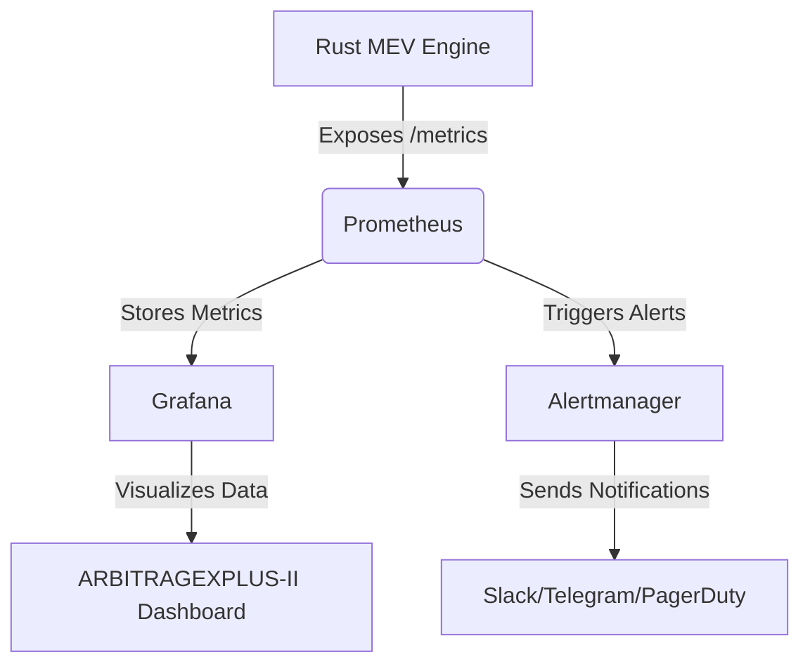

# Mecanismos de Monitoreo y Métricas Clave para el Bot MEV (ARBITRAGEXPLUS-II) en Producción

## 1. Introducción

El monitoreo es un pilar fundamental para la operación exitosa y sostenible de un bot MEV en producción. Dada la naturaleza de alta frecuencia, baja latencia y alta competencia del espacio MEV, una visibilidad completa del rendimiento del bot, la salud de la infraestructura y la rentabilidad de las estrategias es indispensable. Un sistema de monitoreo robusto permite la detección temprana de anomalías, la respuesta rápida a incidentes y la optimización continua de las operaciones. Este documento detalla los mecanismos de monitoreo propuestos y las métricas clave para evaluar el rendimiento del bot `ARBITRAGEXPLUS-II`.

## 2. Stack de Monitoreo Propuesto

El sistema de monitoreo para `ARBITRAGEXPLUS-II` se basa en un stack de herramientas de código abierto ampliamente adoptadas en entornos de producción de alta exigencia [1]:

*   **Prometheus:** Un sistema de monitoreo y alerta de código abierto que recopila y almacena métricas como series de tiempo. El `Monitoring Module` del `Rust MEV Engine` expondrá un *endpoint* `/metrics` que Prometheus raspará periódicamente [2].
*   **Grafana:** Una plataforma de código abierto para la visualización y el análisis de datos. Se utilizará para crear dashboards interactivos que muestren las métricas recopiladas por Prometheus, permitiendo una visión en tiempo real del estado y rendimiento del bot [3].
*   **Alertmanager:** Un componente de Prometheus que gestiona las alertas, deduplicándolas, agrupándolas y enrutándolas a los receptores adecuados (ej. Slack, Telegram, PagerDuty) [4].

## 3. Métricas Clave para Evaluar el Rendimiento

Las métricas se categorizan para proporcionar una visión holística del rendimiento del bot, abarcando aspectos financieros, operativos, técnicos y de infraestructura.

### 3.1. Métricas Financieras y de Rentabilidad

Estas métricas son cruciales para entender la efectividad de las estrategias MEV y la rentabilidad neta del bot:

*   **P&L (Profit & Loss) Neto:** Ganancia o pérdida total después de deducir todos los costos (gas, tarifas de protocolo, costos de infraestructura). Desglosado por día, semana, mes y por estrategia (arbitraje DEX, liquidaciones, sandwich, etc.).
*   **P&L Bruto:** Ganancia o pérdida antes de deducir los costos de gas y tarifas.
*   **ROI (Return on Investment):** Rentabilidad de la inversión de capital en el bot.
*   **Capital Utilizado:** Cantidad de capital activo en las operaciones del bot.
*   **Costo de Gas por Operación:** Gas promedio gastado por cada transacción exitosa y fallida.
*   **Tarifas de Protocolo:** Costos asociados a las tarifas de los DEXs o protocolos de préstamo.
*   **Drawdown Máximo:** La mayor caída porcentual desde un pico en el capital del bot. Una métrica clave de riesgo [5].
*   **Sharpe Ratio:** Mide el rendimiento ajustado al riesgo de la estrategia [5].

### 3.2. Métricas Operacionales y de Estrategia

Estas métricas evalúan la eficiencia y el éxito de la ejecución de las estrategias MEV:

*   **Tasa de Éxito (Hit Rate):** Porcentaje de oportunidades detectadas que resultan en una transacción exitosa y rentable. Desglosado por estrategia.
*   **Tiempo de Detección a Ejecución (TTD - Time To Detection/Execution):** Latencia desde que una oportunidad es detectada hasta que el *bundle* es enviado y confirmado en un bloque. Crítico para la competencia MEV.
*   **Oportunidades Detectadas:** Número total de oportunidades MEV identificadas por el `MEV Scanner`.
*   **Oportunidades Filtradas/Descartadas:** Número de oportunidades que no pasaron el `Pre-Trade Checker` o el `Risk Manager`.
*   **Transacciones Fallidas:** Número y porcentaje de transacciones que revirtieron o no fueron incluidas en un bloque, con sus códigos de error.
*   **Slippage Real vs. Estimado:** Comparación del *slippage* experimentado en la ejecución con el *slippage* predicho por el `Gas Predictor`.
*   **Número de *Bundles* Enviados:** Total de *bundles* enviados a los *relays* de Flashbots/MEV-Share.
*   **Número de *Bundles* Incluidos:** Total de *bundles* que fueron exitosamente incluidos en un bloque.

### 3.3. Métricas de Salud del Sistema y de Infraestructura

Estas métricas aseguran que la infraestructura subyacente esté funcionando de manera óptima:

*   **Uptime del Bot:** Porcentaje de tiempo que el `Rust MEV Engine` está operativo.
*   **Latencia de RPC:** Tiempo de respuesta promedio de las conexiones a los nodos RPC. Monitoreado por el `RPC Manager`.
*   **Conexiones a RPCs:** Número de conexiones activas y fallidas a los nodos RPC.
*   **Salud de la Base de Datos (PostgreSQL):** Uso de CPU, memoria, disco, conexiones activas, latencia de consultas.
*   **Salud del Sistema de Colas (Redis Streams):** Uso de memoria, latencia de lectura/escritura, tamaño de la cola, número de consumidores.
*   **Uso de Recursos del Servidor (CPU, RAM, Disco, Red):** Métricas estándar de uso de recursos del VPS donde se ejecuta el bot.
*   **Errores y Logs:** Recuento de errores en los logs, con clasificación por tipo y severidad. Los logs detallados se almacenarán en PostgreSQL para análisis forense.

## 4. Mecanismos de Alerta

El `Alertmanager` se configurará para enviar notificaciones críticas a los canales designados (ej. Slack, Telegram, PagerDuty) cuando las métricas superen umbrales predefinidos. Las alertas deben ser accionables y priorizadas para evitar la fatiga de alertas [6].

Ejemplos de alertas críticas:

*   **P&L Negativo:** Si el P&L neto diario cae por debajo de un umbral (ej. -$200).
*   **Tasa de Éxito Baja:** Si la tasa de éxito de las transacciones cae por debajo de un porcentaje (ej. < 50%) durante un período prolongado.
*   **Latencia Elevada:** Si la latencia de RPC o el TTD excede un umbral (ej. > 100ms).
*   **Errores de Ejecución:** Alto volumen de transacciones fallidas o revertidas.
*   **Fallo de Componente:** Caída del `Rust MEV Engine`, base de datos o sistema de colas.
*   **Uso Crítico de Recursos:** Uso de CPU o memoria del servidor por encima del 90%.
*   **Desconexión de RPC:** Pérdida de conexión con un proveedor de RPC primario.

## 5. Dashboards de Grafana

Se crearán dashboards personalizados en Grafana para visualizar las métricas clave. Estos dashboards incluirán:

*   **Dashboard de Rendimiento General:** P&L neto/bruto, ROI, drawdown, capital utilizado, tasa de éxito global.
*   **Dashboard por Estrategia:** P&L, tasa de éxito, oportunidades detectadas/ejecutadas para cada estrategia (arbitraje DEX, liquidaciones, sandwich).
*   **Dashboard de Latencia:** TTD, latencia de RPC, tiempo de construcción de *bundle*.
*   **Dashboard de Salud del Sistema:** Uso de CPU/RAM, estado de la base de datos y Redis, errores en logs.
*   **Dashboard de Transacciones:** Detalle de transacciones exitosas y fallidas, gas consumido, *slippage*.

## 6. Mejores Prácticas de Monitoreo

Para un monitoreo efectivo del bot MEV, se recomienda seguir estas mejores prácticas:

*   **Monitoreo 24/7:** El bot opera continuamente, por lo que el monitoreo debe ser constante.
*   **Alertas Accionables:** Cada alerta debe tener un *runbook* asociado que describa los pasos a seguir para diagnosticar y resolver el problema [7].
*   **Granularidad:** Recopilar métricas con suficiente granularidad (ej. cada 5-10 segundos) para detectar problemas rápidamente.
*   **Historial de Datos:** Mantener un historial de métricas a largo plazo para análisis de tendencias y post-mortem.
*   **Pruebas de Alertas:** Probar regularmente el sistema de alertas para asegurar que funciona correctamente.
*   **Seguridad del Monitoreo:** Proteger el acceso a Prometheus, Grafana y Alertmanager, ya que contienen información sensible sobre el rendimiento del bot.
*   **Monitoreo de Costos:** Además de las métricas de rendimiento, monitorear activamente los costos de infraestructura (RPCs, VPS) para asegurar que el bot sigue siendo rentable.

## 7. Conclusión

Un sistema de monitoreo integral es esencial para la operación de un bot MEV de alto rendimiento como `ARBITRAGEXPLUS-II`. Al implementar un stack de monitoreo robusto con Prometheus, Grafana y Alertmanager, y al enfocarse en métricas financieras, operacionales y de salud del sistema, el equipo puede asegurar la máxima rentabilidad, minimizar los riesgos y mantener una operación continua y eficiente. La capacidad de reaccionar rápidamente a los cambios del mercado y a los problemas técnicos es lo que distingue a un bot MEV exitoso en el competitivo panorama de DeFi.

## 8. Referencias

[1] Troniex Technologies. *MEV Bot Development | Create Your Own MEV Trading Bot*. Disponible en: [https://www.troniextechnologies.com/blog/mev-bot-development](https://www.troniextechnologies.com/blog/mev-bot-development)
[2] Coincashew. *Monitoring your validator with Grafana and Prometheus*. Disponible en: [https://www.coincashew.com/coins/overview-eth/guide-or-how-to-setup-a-validator-on-eth2-mainnet/part-i-installation/monitoring-your-validator-with-grafana-and-prometheus](https://www.coincashew.com/coins/overview-eth/guide-or-how-to-setup-a-validator-on-eth2-mainnet/part-i-installation/monitoring-your-validator-with-grafana-and-prometheus)
[3] Grafana. *Get started with Grafana and Prometheus*. Disponible en: [https://grafana.com/docs/grafana/latest/getting-started/get-started-grafana-prometheus/](https://grafana.com/docs/grafana/latest/getting-started/get-started-grafana-prometheus/)
[4] Prometheus. *Alertmanager*. Disponible en: [https://prometheus.io/docs/alerting/latest/alertmanager/](https://prometheus.io/docs/alerting/latest/alertmanager/)
[5] Focal. *5 Key Metrics to Evaluate HFT Performance*. Disponible en: [https://www.getfocal.co/post/5-key-metrics-to-evaluate-hft-performance](https://www.getfocal.co/post/5-key-metrics-to-evaluate-hft-performance)
[6] Medium. *MEV & Flashbots Transaction Monitoring — Detecting Stealth Institutional Trades in Blockchain*. Disponible en: [https://medium.com/@readeedwardson/mev-flashbots-transaction-monitoring-detecting-stealth-institutional-trades-in-blockchain-217e9c73cacf](https://medium.com/@readeedwardson/mev-flashbots-transaction-monitoring-detecting-stealth-institutional-trades-in-blockchain-217e9c73cacf)
[7] Chain Security. *Nodes, Algorithm, and Network*. Disponible en: [https://link.springer.com/chapter/10.1007/978-3-031-39288-7_2](https://link.springer.com/chapter/10.1007/978-3-031-39288-7_2)

